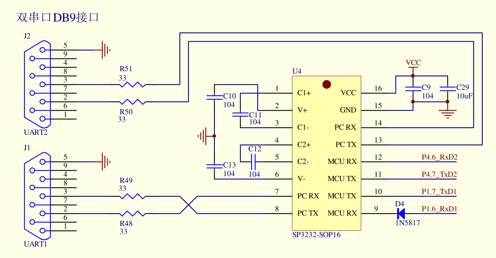

# 使用单片机串口发送键码 

## 单片机型号
IAP15W4K58S4

## 接口图

## 使用单台单片机进行测试
连接该台单片机的UART1的2号孔(RX)和3号孔(TX)

## 使用两台单片机进行测试
连接`单片机A的UART1的2号孔(RX)`和`单片机B的UART1的3号孔(TX)`

连接`单片机B的UART1的2号孔(RX)`和`单片机A的UART1的3号孔(TX)`

## 按键说明
* 键位0: 小时+
* 键位1: 小时-
* 键位2: 分钟+
* 键位3: 分钟-
