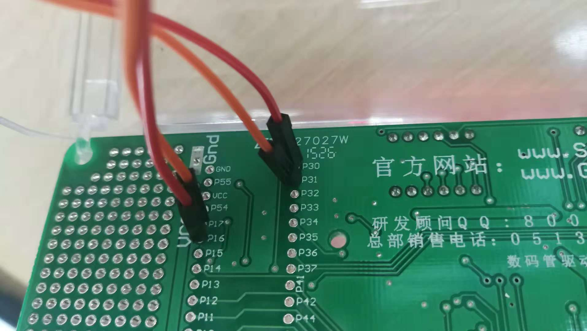
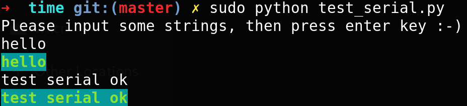

# 使用单片机串口发送键码 

## 单片机型号
IAP15W4K58S4

## 接口图


## 工程文件
* C语言

`time.uvproj`

* 汇编

`remote_key_asm.uvproj`

## 使用单台单片机进行测试
连接该台单片机的UART1的2号孔(RX)和3号孔(TX)

## 使用两台单片机进行测试
连接`单片机A的UART1的2号孔(RX)`和`单片机B的UART1的3号孔(TX)`

连接`单片机B的UART1的2号孔(RX)`和`单片机A的UART1的3号孔(TX)`

如果两台单片机不是由同一台设备提供电源，需要对接两台单片机UART1的5号孔使其共地。

## 按键说明
* 键位0: 小时+
* 键位1: 小时-
* 键位2: 分钟+
* 键位3: 分钟-

# PC与单片机交互

## 连接方式
使用串口转USB转接器，或者按以下方法连接单片机，使用烧录程序的USB传输数据。


P16与P30相连，P17与P31相连。

## 第三方依赖

需要安装pyserial库。

```bash
pip install pyserial
```

## 设置

根据需要修改`test_serial.py`中的`PORT, BAUDRATE`参数。

## 执行
`sudo python test_serial.py`

注：需要管理员权限

## 执行结果

